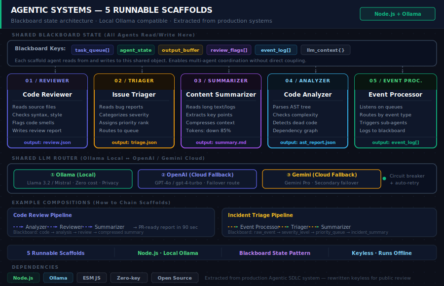

# Agentic Systems

**5 multi-agent systems you can clone, run, and learn from.**

Each one solves a real task. Each one is a different agent topology: single agent,
2-agent DAG, 3-agent DAG. Read the code, run it, then modify it. That is the
intended use.

All systems run offline with zero cost using Ollama. No API key needed to start.

[](LICENSE)


---

## The 5 Systems

| System | Shape | What it does | Run it |
| :--- | :--- | :--- | :--- |
| **[01 Research Agent](./01-research-agent)** | Single agent | Takes a topic, runs searches, returns a markdown brief | `node index.js --topic "your topic"` |
| **[02 Code Reviewer](./02-code-reviewer)** | 2-agent DAG | Reads a file, one agent audits, one generates fixes | `node index.js --file src/yourfile.js` |
| **[03 Blog Post Generator](./03-blog-post-generator)** | 3-agent DAG | Planner outlines, researcher fills in, writer drafts | `node index.js --topic "your topic"` |
| **[04 Test Case Generator](./04-test-case-generator)** | Single agent | Reads a function signature, writes Jest test cases | `node index.js --file src/core/BaseAgent.js` |
| **[05 Bug Triage](./05-bug-triage)** | 2-agent DAG | Classifies a bug report, routes it to the right team | `node index.js --issue "Users can't log in"` |

---

## 🎓 Learning Paths

### Beginner Path (Start Here)
Follow this sequence to learn multi-agent patterns progressively:

1. **[01 — Research Agent](./01-research-agent)** (Single agent, simplest)
   - Learn: Blackboard state, multi-provider routing, response caching
   - Run: `node index.js --topic "machine learning"` → markdown file
   - Time: 10 minutes

2. **[04 — Test Case Generator](./04-test-case-generator)** (Single agent, different pattern)
   - Learn: Input/output validation, LLM → structured output parsing
   - Run: `node index.js --file src/core/BaseAgent.js --function execute`
   - Time: 10 minutes

3. **[05 — Bug Triage System](./05-bug-triage)** (2-agent DAG, intro to multi-agent)
   - Learn: DAGRunner, agent coordination, context passing between agents
   - Run: `node index.js --issue "Users can't log in"`
   - Time: 15 minutes

4. **[03 — Blog Post Generator](./03-blog-post-generator)** (3-agent DAG, complex)
   - Learn: Looping within DAGs, artifact chaining, real-world complexity
   - Run: `node index.js --topic "AI in 2027"`
   - Time: 20 minutes

5. **[02 — Code Reviewer](./02-code-reviewer)** (2-agent DAG, advanced patterns)
   - Learn: Graph context (reading other agents' output), refactoring suggestions
   - Run: `node index.js --file src/core/BaseAgent.js`
   - Time: 15 minutes

**Total beginner path**: ~70 minutes, covers all core patterns

### Advanced Path (For Architects)
If you already understand agents:
- Jump straight to [02 — Code Reviewer](./02-code-reviewer) to see DAG coordination
- Read [agentic-patterns](https://github.com/shubham0086/agentic-patterns) docs (theory behind these systems)
- Modify a system: add a 4th agent to Blog Post Generator (Reviewer agent that quality-checks drafts)

---

## Visual Architecture

**How the 5 systems relate — shared core, different agent topologies:**

```mermaid
graph LR
    INPUT([Goal / Input]) --> CORE

    subgraph CORE ["Shared Core"]
        direction TB
        BB[Blackboard\ncentralized state]
        DAG[DAGRunner\nKahn's algorithm]
        BASE[BaseAgent\nLLM + cache + circuit breaker]
    end

    subgraph SYSTEMS ["5 Systems"]
        direction TB
        S1[01 Research Agent\nsingle agent]
        S2[02 Code Reviewer\n2-agent DAG]
        S3[03 Blog Generator\n3-agent DAG]
        S4[04 Test Generator\nsingle agent]
        S5[05 Bug Triage\n2-agent DAG]
    end

    CORE --> SYSTEMS
    SYSTEMS --> OUT([Artifact\nmarkdown / tests / triage])

    style INPUT fill:#0f172a,stroke:#6366f1,color:#818cf8
    style BB   fill:#1e293b,stroke:#6366f1,color:#f8fafc
    style DAG  fill:#1e293b,stroke:#6366f1,color:#f8fafc
    style BASE fill:#1e293b,stroke:#818cf8,color:#f8fafc
    style S1   fill:#1e293b,stroke:#a855f7,color:#f8fafc
    style S2   fill:#1e293b,stroke:#a855f7,color:#f8fafc
    style S3   fill:#1e293b,stroke:#a855f7,color:#f8fafc
    style S4   fill:#1e293b,stroke:#a855f7,color:#f8fafc
    style S5   fill:#1e293b,stroke:#a855f7,color:#f8fafc
    style OUT  fill:#0f172a,stroke:#10b981,color:#10b981
```



**Architecture reference (5 scaffolds + shared core annotated):**



**Animated system map (open in browser):**

The `visual/` folder contains `visual-systems.html` — a standalone animated diagram showing all 5 agent systems and how the shared core wires them together. No dependencies, no build step.

```
open visual/visual-systems.html
# or: python -m http.server 8080 → localhost:8080/visual/visual-systems.html
```

> Full portfolio case study with live animations: [shubham0086.github.io/MyPortfolio.github.io/projects/agentic-systems.html](https://shubham0086.github.io/MyPortfolio.github.io/projects/agentic-systems.html)

---

## ⚙️ Standardized Core Architecture



Every template in this repository uses a unified core directory (`src/core/`) to maintain consistency and ease of learning:

1. **`Blackboard.js` (State Manager)**:
   - Centralized, append-only state store.
   - Prevents race conditions and ensures agents never mutate state directly.
   - Active cost calculation and **Budget Guard** (throws `Error` immediately if usage crosses a set USD threshold).
2. **`BaseAgent.js` (LLM Engine)**:
   - Out-of-the-box support for `Ollama` (local, free), `OpenCode`, `OpenRouter`, `Gemini`, `OpenAI`, and `Anthropic`.
   - **Session-Level Response Caching** (SHA-256 keyed) to eliminate redundant LLM API hits.
   - **Circuit Breaker fallback**: automatically routes to the next model in a custom priority list if a provider times out or fails.
3. **`DAGRunner.js` (Orchestrator)**:
   - Implements **Kahn's Algorithm** for topological sorting.
   - Handles parallel and sequential execution of agents based on declared dependencies.

---

## 🚀 Quick Start (Local Ollama Execution)

To run any of the templates for free on your local machine:

### 1. Prerequisites
Install [Ollama](https://ollama.com) and pull your model:
```bash
ollama pull qwen2.5-coder:7b
```

### 2. Run a System
Choose a system directory (e.g., Code Reviewer), install dependencies, copy environment configs, and run:
```bash
cd 02-code-reviewer
npm install
cp .env.example .env
node index.js --file src/core/BaseAgent.js
```

**Output**: Outputs a structured `review-BaseAgent.md` report showing violations, improvements, style comments, and refactored code snippets.

---

## 🎯 Production Engineering Decisions

- **Vulnerability Minimization**: API keys are loaded solely through `.env` configs. The `.env` pattern is strictly ignored in git, with placeholders documented in `.env.example`.
- **Parsing Robustness**: Instead of vulnerable raw JSON parsing on freeform LLM outputs, the core utilizes `BaseAgent.cleanJSON`, which strips markdown wrappers and extracts structured JSON reliably.
- **Observability Built-In**: Each system includes a `memory/reality/` folder containing ground-truth YAML specifications detailing claims about what the code does and the exact commands to verify them.

---

## 📚 Study Guides & Implementation Links
- **Pattern 01 (DAG Coordination)**: See [02 — Code Reviewer](./02-code-reviewer) and [03 — Blog Post Generator](./03-blog-post-generator).
- **Pattern 02 (LLM Fallbacks)**: See `src/core/BaseAgent.js` across all folders.
- **Pattern 05 (Caching & Evals)**: See [04 — Test Case Generator](./04-test-case-generator) and `memory/reality/` YAML validations.

---

## License
Licensed under the [MIT License](LICENSE)—feel free to fork, adapt, and build commercial products on top of these templates!
